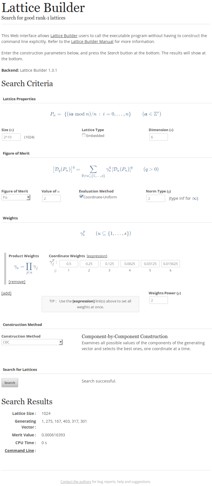

# Lattice Builder
_A general software tool for constructing rank-1 lattice rules_

*Lattice rules* are often used as a replacement for [Monte
Carlo](http://en.wikipedia.org/wiki/Monte_Carlo_integration) to integrate
multidimensional functions.
For certain problems, well-constructed lattice rules can dramatically reduce the integration error with respect to Monte Carlo.

Lattice Builder is a software tool and library that implements a variety of
construction algorithms for good rank-1 lattice rules.
It supports exhaustive and random searches, as well as component-by-component
(CBC) and random CBC constructions, for any number of points, and for various
measures of (non)uniformity of the points.
The implemented measures include the weighted Pα square discrepancy,
the Rα criterion, and figures of merit based on the spectral test,
with projection-dependent weights.
For numbers of points that are integer powers of a prime base, the construction
of embedded rank-1 lattice rules is supported through any of the above
algorithms, and also through a fast CBC algorithm, with a variety of
possibilities for the normalization of the merit values of individual embedded
levels and for their combination into a single merit value.

#### Reference Publication

Details about lattice rules and Lattice Builder can be found in
[*Lattice Builder*: A General Software Tool for Constructing Rank-1 Latice Rules](http://www.iro.umontreal.ca/~lecuyer/myftp/papers/latbuilder.pdf).

## Installing Lattice Builder

You may choose to install Lattice Builder by either:

* [downloading a binary (pre-compiled) release](#binary-releases); or
* [compiling the source code](#compiling-the-source-code).

### Binary Releases

[Binary (pre-compiled) releases](http://simul.iro.umontreal.ca/latbuilder/bin/)
of Lattice Builder are available for Linux and Microsoft Windows platforms.
These include the executable `latbuilder` program, library and documentation,
together with the optional web interface.

The binary distribution packages, under the `latbuilder` base directory, have
the following directory structure:

* `bin`: contains the executable `latbuilder` program;
* `include`: contains the C++ header files necessary to use the Lattice Builder
  library;
* `lib`: contains the binary Lattice Builder library;
* `share/doc/latbuilder/html`: contains the HTML documentation;
* `share/doc/latbuilder/examples`: contains examples on using the Lattice
  Builder library;

To use the Lattice Builder program, **simply unpack the archive** (no further
installation is required) and move to its root directory (it should be named
`latbuilder`), then check try to access the executable in the `bin`
subdirectory:
  
	bin/latbuilder --version

This should output the version number of Lattice Builder.

**Microsoft Windows** users should replace `bin/latbuilder` with
`bin\latbuilder.exe` in the above command line.

Next, you can learn about [using Lattice Builder](#using-lattice-builder).

### Compiling the Source Code

#### Software Dependencies

Compiling Lattice Builder requires 
[some software dependencies](#software-dependencies) must be
installed prior to installing / using Lattice Builder.

* [Python 2.7](http://python.org/)
* [Boost C++ Libraries](http://www.boost.org/) 1.55.0 or later: installation instructions
  for [Linux / MacOS](http://www.boost.org/doc/libs/release/more/getting_started/unix-variants.html),
  or [Microsoft Windows](http://www.boost.org/doc/libs/release/more/getting_started/windows.html)
  (**also follow the instructions from section 5!**)
* [FFTW 3](http://fftw.org/)
* [Git](http://git-scm.com/) *(optional for downloading the source code)*
* [Doxygen](http://www.stack.nl/~dimitri/doxygen/) *(optional for generating
  the documentation)*

You will also need a recent enough compiler compliant with the C++11 standard.
Lattice Builder is known to compile using:
* [GCC](http://gcc.gnu.org/) 4.8 or 4.9 on Linux
* [clang](http://clang.llvm.org/) 3.6.0 on Linux

**MacOS** users can install these dependencies through
[MacPorts](http://www.macports.org/) by [installing the MacPorts
software](http://www.macports.org/install.php), then by installing the
following packages:
[python27](https://trac.macports.org/browser/trunk/dports/lang/python27/Portfile),
[boost](https://trac.macports.org/browser/trunk/dports/devel/boost/Portfile),
[fftw-3](https://trac.macports.org/browser/trunk/dports/math/fftw-3/Portfile),
[git](https://trac.macports.org/browser/trunk/dports/devel/git/Portfile) and
[doxygen](https://trac.macports.org/browser/trunk/dports/textproc/doxygen/Portfile).

#### Obtaining the Source Code

Get the latest source tree from GitHub, either by typing:

	git clone https://github.com/mungerd/latbuilder.git

If [Git](http://git-scm.com/) is not available on your system, you can click on
the [Download ZIP](https://github.com/mungerd/latbuilder/archive/master.zip)
link from the [Lattice Builder GitHub
page](https://github.com/mungerd/latbuilder), then by unzipping the downloaded
archive.

#### Configuring the Build

Lattice Builder relies on the
[waf meta build system](https://code.google.com/p/waf/) for configuring and
compiling the software source.
Waf is included in the Lattice Builder source tree, but it depends on
[Python 2.7](http://python.org/download), which must be available on the system
on which Lattice Builder is to be compiled.

The commands below should work verbatim under Linux and MacOS systems.
**Microsoft Windows** users should replace every instance of `./waf` 
with `C:\Python27\python waf`, assuming that the Python executable
(`python.exe`) was installed under `C:\Python27`, or simply with `python waf`
if the Python installation path is accessible from the system `%PATH%`
environment variable.

Change the current directory to the root directory of the package, for example:

	cd latbuilder

if you obtained the source code with the `git` command.
If you obtained the source code from the ZIP archive, the directory should be
named `latbuilder-master` instead of `latbuilder`.
At the root of the source tree lies the `waf` script, manages the build
process.
Try:

	./waf --help

to see the various commands and options.
The most relevant options include `--out` to specify the directory in which the
files created during the build process will be placed, `--prefix` to specify
the directory under which you wish to install the Lattice Builder software
**once it is compiled**, and `--boost` and `--fftw` to specify the directories
under which Boost and FFTW were installed, if not under standard system
directories.  First, the project must be configured with:

	./waf configure --prefix $HOME/latsoft

with `$HOME/latsoft` replaced with the directory into which you wish to install
Lattice Builder.
Here, `$HOME` will expand to your own home directory; you can specify any other
directory to which you have permissions for write access, e.g., with `--prefix
/tmp/latsoft`.

If Boost and FFTW are not part of the standard system installation and were
manually installed under, say, the `/opt/boost` and `/opt/fftw` directories —
which means that `/opt/boost` and `/opt/fftw` both contain subdirectories named
`include` and `lib` — the following command indicates `waf` where to find these
two libraries:

	./waf configure --prefix $HOME/latsoft --boost /opt/boost --fftw /opt/fftw configure --link-static

The `--link-static` option suggested above will case the Boost and FFTW
libraries to be linked statically to the executable program, which may be
desirable especially if these are not installed in standard locations.

It is possible to set the `CXX` environment variable to the path to a specific
C++ compiler to be used to build Lattice Builder, before running the `waf
configure` command.

The above  ̀waf configure` commands configures `waf` for a minimal build,
without documentation, code examples nor web interface.  These can be built by
appending the following options to `waf configure`:

* `--build-docs` to generate the documentation, if
  [Doxygen](http://www.stack.nl/~dimitri/doxygen/) is available on the system.
* `--build-examples` to compile, execute and install example code, including
  code from the tutorial.
* `--build-web-ui` to generate the web interface (this will cause waf to
  download a patched version of [pyjs](http://pyjs.org/) during the build
  process).

Errors will be reported if required software components cannot be found.  In
that case, you should check the Boost and FFTW installation paths.

#### Building and Installing

Once everything is configured correctly, the following command will build the
Lattice Builder library and command-line tool:

	./waf build

If the build process completed without errors, Lattice Builder can be installed
to `$HOME/latsoft`, or any directory specified with the `--prefix` options
during the configuration step, with:

	./waf install

The Lattice Builder executable can be found at `$HOME/latsoft/bin/latbuilder`
(with an additional `.exe` extension under Windows systems).

Before executing the Lattice Builder program, it may be necessary to
to add the paths to the Boost and FFTW libraries to the `LD_LIBRARY_PATH` (for
Linux) or to the `DYLD_FALLBACK_LIBRARY_PATH` (for MacOS) environment
variables, especially if you did not use the `--link-static` option on `waf
configure`.
For example, if you're using an `sh`-compatible shell and Boost and FFTW were
manually installed under the `/opt/boost` and `/opt/fftw` directories,
respectively, type:

	export LD_LIBRARY_PATH=/opt/boost/lib:/opt/fftw/lib:$LD_LIBRARY_PATH

under Linux, or

	export DYLD_FALLBACK_LIBRARY_PATH=/opt/boost/lib:/opt/fftw/lib:$DYLD_FALLBACK_LIBRARY_PATH

under MacOS.

**Microsoft Windows** users might need to copy the Boost and FFTW DLLs into the
same directory (`$HOME/latsoft/bin`, for example) as the `latbuilder`
executable program.

To check that the program installed correctly, run:

	$HOME/latsoft/bin/latbuilder --version

which should report the current Lattice Builder version.
Help on usage can be obtained by replacing the `--version` switch with the
`--help` switch.

## Using Lattice Builder

### The Lattice Builder Program

To construct, using the component-by-component (CBC) algorithm, a rank-1
lattice rule with 8191 points in 5 dimensions using the Pα criterion with
α=2 and with uniform product weights with value 0.1, issue the following
command (from the installation directory):

	bin/latbuilder -l ordinary -n 8191 -d 5 -m CS:P2 -w product:0.1 -c CBC

For more information on using the Lattice Builder program, read the [Lattice
Builder command line
tutorial](http://simul.iro.umontreal.ca/latbuilder/doc/d5/d56/cmdtut.html) that
can also be found in `share/doc/latbuilder/html/cmdtut.html`, or try
`bin/latbuilder --help`.

**Microsoft Windows** users should replace `bin/latbuilder` with
`bin\latbuilder.exe` in the above.

### The Lattice Builder Web Interface

The Lattice Builder Web Interface is included in the binary packages.
[Python 2.7](http://python.org/download/) must be installed on the host machine.
The local web server can be started by launching the following Python script:

	bin/LatBuilderWeb.py

The web interface can then be used by connecting a browser to the
[http://localhost:8080](http://localhost:8080/LatBuilderWeb.html).
It requires the Lattice Builder program above to be working properly.

**Microsoft Windows** users should replace `bin/LatBuilderWeb.py` with
`C:\Python27\python.exe bin\LatBuilderWeb.py` in the above, assuming that
Python 2.7 was installed under `C:\Python27`.

### The Lattice Builder Library

#### Understanding the API

Several examples of code using the Lattice Builder application programming
interface (API) can be found under the `share/doc/latbuilder/examples`
directory under the installation directory and in subdirectories.

To teach yourself how to code using the Lattice Builder library, you can read:

* [High-Level API Tutorial](http://simul.iro.umontreal.ca/latbuilder/doc/d5/d98/hightut.html)
* [Low-Level API Tutorial](http://simul.iro.umontreal.ca/latbuilder/doc/da/d6f/libtut.html)

#### Compiling and Linking

Compiling and linking code with the Lattice Builder library requires the same
[software dependencies](#software-dependencies) to be available as for
compiling the Lattice Builder program itself.

External software can make use of the Lattice Builder libraries by
setting the compiler to use the C++11 standard, by adding the `include`
and `lib` directories (under the installation directory) to the include and
library paths, respectively, then by linking with the `latcommon` and
`latbuilder` libraries, together with the `fftw3` library.
An example `Makefile` to build a project that uses the Lattice Builder
application programming interface (API) can be found under
`$HOME/latsoft/share/doc/latbuilder/examples/myproject`.
If you compiled Lattice Builder yourself from the source code, this `Makefile`
will be adapted to your specific system configuration; otherwise, it may need
to be customized.

In particular, if Lattice Builder, Boost and FFTW were respectively installed
under `$HOME/latsoft`, `/opt/boost` and `/opt/FFTW`, a C++ source file called
`myprog.cc` can be compiled and linked into an executable called `myprog` by
using the following command line with GCC:

	g++ -std=c++11 -I$HOME/latsoft/include -I/opt/boost/include -I/opt/fftw/include -O2 -o myprog myprog.cc -L$HOME/latsoft/lib -l latbuilder -l latcommon -L/opt/fftw/lib -l fftw3

With clang, just replace `g++` with `clang++`.

## Further Reading

* [*Lattice Builder*: A General Software Tool for Constructing Rank-1 Latice Rules](http://www.iro.umontreal.ca/~lecuyer/myftp/papers/latbuilder.pdf).
* [Lattice Builder Command Line Tutorial](http://simul.iro.umontreal.ca/latbuilder/doc/d5/d56/cmdtut.html)
* [Lattice Builder Manual](http://simul.iro.umontreal.ca/latbuilder/doc/)

## Frequently Asked Questions

### What construction type should I use to find good high-dimensional lattices in reasonable time?

Fast CBC with a coordinate-symmetric figure of merit.

For example, the following command line performs a fast CBC construction using
the weighted Pα criterion with α=2 and with product weights giving
the same weight of 0.01 to every coordinate (this means a weight of
10-2 for projections of order 1, of 10-4 for projections
of order 2, of 10-6 for projections of order 3, etc.):

	latbuilder -l ordinary -n 2^16 -d 100 -m CS:P2 -c fast-CBC -w product:0.01

The above search is for n=216=65,536 points in dimension 100.  Lattice Builder
does that very quickly.
It may be necessary to enclose some arguments in double quotes, depending on
the shell (command line interpreter), e.g.:

	latbuilder -l "ordinary" -n "2^16" -d "100" -m "CS:P2" -c "fast-CBC" -w "product:0.01"
